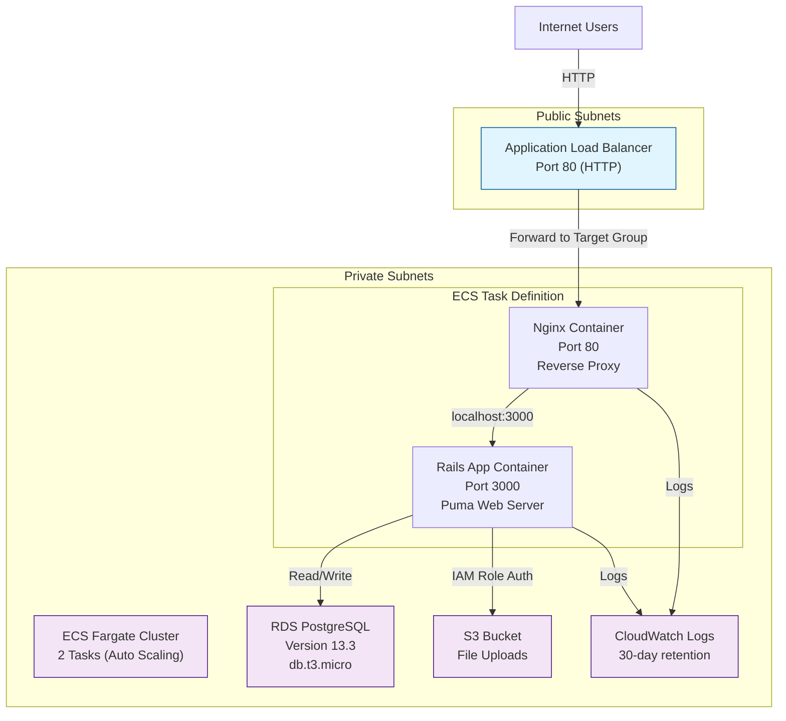

# Architecture Diagram



## Network Architecture

```
┌─────────────────────────────────────────────────────┐
│                     AWS Cloud                        │
│  ┌──────────────────────────────────────────────┐   │
│  │              VPC (10.0.0.0/16)               │   │
│  │                                               │   │
│  │  ┌────────────────────┐  ┌────────────────┐  │   │
│  │  │ Public Subnet A    │  │ Public Subnet B│  │   │
│  │  │ 10.0.1.0/24        │  │ 10.0.2.0/24    │  │   │
│  │  │ ┌──────────────┐   │  │ ┌────────────┐ │  │   │
│  │  │ │ NAT Gateway  │   │  │ │   ALB      │ │  │   │
│  │  │ └──────────────┘   │  │ └────────────┘ │  │   │
│  │  └────────────────────┘  └────────────────┘  │   │
│  │                                               │   │
│  │  ┌────────────────────┐  ┌────────────────┐  │   │
│  │  │ Private Subnet A   │  │ Private Subnet B│  │   │
│  │  │ 10.0.10.0/24       │  │ 10.0.20.0/24   │  │   │
│  │  │ ┌──────────────┐   │  │ ┌────────────┐ │  │   │
│  │  │ │ ECS Fargate  │   │  │ │ ECS Fargate│ │  │   │
│  │  │ │ Tasks        │   │  │ │ Tasks      │ │  │   │
│  │  │ └──────────────┘   │  │ └────────────┘ │  │   │
│  │  │ ┌──────────────┐   │  │                │  │   │
│  │  │ │ RDS          │   │  │                │  │   │
│  │  │ │ PostgreSQL   │   │  │                │  │   │
│  │  │ └──────────────┘   │  │                │  │   │
│  │  └────────────────────┘  └────────────────┘  │   │
│  │                                               │   │
│  │  ┌────────────────────────────────────────┐   │   │
│  │  │           S3 Bucket (Global)           │   │   │
│  │  └────────────────────────────────────────┘   │   │
│  └──────────────────────────────────────────────┘   │
└─────────────────────────────────────────────────────┘
```

## Data Flow

1. **User** sends HTTP request to **ALB DNS name**
2. **ALB** forwards request to **Nginx container** in ECS task
3. **Nginx** reverse-proxies to **Rails app** on `localhost:3000`
4. **Rails app** connects to **RDS PostgreSQL** for data persistence
5. **Rails app** reads/writes files to **S3 bucket** using IAM role authentication
6. All container logs stream to **CloudWatch Logs**
